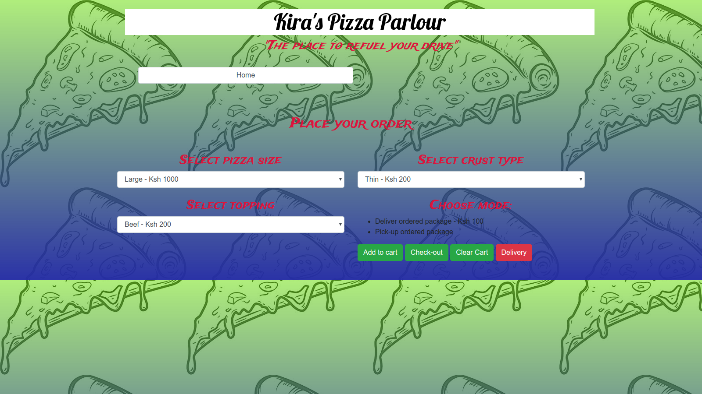

# KIRA'S PIZZA PARLOUR

  Kira's pizza parlour is an order and delivery platform that gives you the comfort of seating back and getting your pizza order at the comfort of your living room or anywhere you would desire it delivered.

  [link to platform](https://duncan-kiragu.github.io/Kira-s-Pizza-Parlour/)

# DESCRIPTION
> The landing site for Kira's Pizza Parlour whereby the user can scroll the restaurant's menu and pick-out their desired type
    ; the users can now order the food choices online and choose whether they will pick-up from a known location or use delivery services.

## SCREENSHOT

  

# TECHNOLOGIES USED

  - HTML
  - CSS
  - Javascript
  - Bootstrap
  - JQuery
  - Notify JS
  - Markdown file

# COMPATIBILITY

Compatible with most browsers but advisably use Google Chrome or Chromium browsers 

# KNOWN BUGS

  - The javascript does not compute the total prices for items added to the cart;
  - Also the alert pop-up for the address works even without input

# CONTACT FOR SUPPORT

# LICENSE
MIT License

Copyright (c) 2019 **Brian Mwiruki**

Permission is hereby granted, free of charge, to any person obtaining a copy
of this software and associated documentation files (the "Software"), to deal
in the Software without restriction, including without limitation the rights
to use, copy, modify, merge, publish, distribute, sublicense, and/or sell
copies of the Software, and to permit persons to whom the Software is
furnished to do so, subject to the following conditions:

The above copyright notice and this permission notice shall be included in all
copies or substantial portions of the Software.

THE SOFTWARE IS PROVIDED "AS IS", WITHOUT WARRANTY OF ANY KIND, EXPRESS OR
IMPLIED, INCLUDING BUT NOT LIMITED TO THE WARRANTIES OF MERCHANTABILITY,
FITNESS FOR A PARTICULAR PURPOSE AND NONINFRINGEMENT. IN NO EVENT SHALL THE
AUTHORS OR COPYRIGHT HOLDERS BE LIABLE FOR ANY CLAIM, DAMAGES OR OTHER
LIABILITY, WHETHER IN AN ACTION OF CONTRACT, TORT OR OTHERWISE, ARISING FROM,
OUT OF OR IN CONNECTION WITH THE SOFTWARE OR THE USE OR OTHER DEALINGS IN THE
SOFTWARE.
